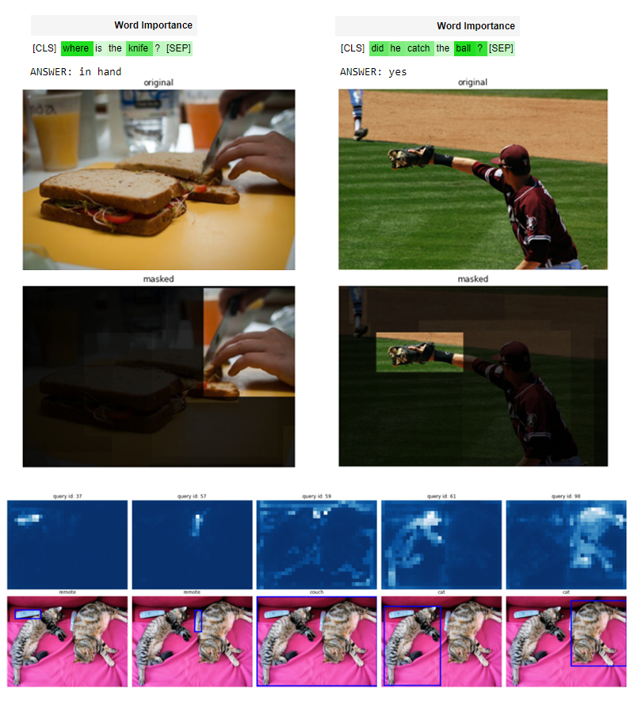

# PyTorch Implementation of [Transformer Interpretability Beyond Attention Visualization](https://arxiv.org/abs/2012.09838) [CVPR 2021]

#### Check out our new advancements- [Generic Attention-model Explainability for Interpreting Bi-Modal and Encoder-Decoder Transformers](https://github.com/hila-chefer/Transformer-MM-Explainability)!
Faster, more general, and can be applied to *any* type of attention!
Among the features:
* We remove LRP for a simple and quick solution, and prove that the great results from our first paper still hold!
* We expand our work to *any* type of Transformer- not just self-attention based encoders, but also co-attention encoders and encoder-decoders!
* We show that VQA models can actually understand both image and text and make connections!
* We use a DETR object detector and create segmentation masks from our explanations!
* We provide a colab notebook with all the examples. You can very easily add images and questions of your own!

<p align="center">
  
</p>

---
## ViT explainability notebook:
[](https://colab.research.google.com/github/hila-chefer/Transformer-Explainability/blob/main/Transformer_explainability.ipynb)

## BERT explainability notebook:
[](https://colab.research.google.com/github/hila-chefer/Transformer-Explainability/blob/main/BERT_explainability.ipynb)
---

## Updates
April 5 2021: Check out this new [post](https://analyticsindiamag.com/compute-relevancy-of-transformer-networks-via-novel-interpretable-transformer/) about our paper! A great resource for understanding the main concepts behind our work.

March 15 2021: [A Colab notebook for BERT for sentiment analysis added!](https://colab.research.google.com/github/hila-chefer/Transformer-Explainability/blob/main/BERT_explainability.ipynb)

Feb 28 2021: Our paper was accepted to CVPR 2021! 

Feb 17 2021: [A Colab notebook with all examples added!](https://github.com/hila-chefer/Transformer-Explainability/blob/main/Transformer_explainability.ipynb)

Jan 5 2021: [A Jupyter notebook for DeiT added!](https://github.com/hila-chefer/Transformer-Explainability/blob/main/DeiT_example.ipynb)


<p align="center">
  
</p>


## Introduction
Official implementation of [Transformer Interpretability Beyond Attention Visualization](https://arxiv.org/abs/2012.09838).

We introduce a novel method which allows to visualize classifications made by a Transformer based model for both vision and NLP tasks.
Our method also allows to visualize explanations per class.

<p align="center">
  
</p>
Method consists of 3 phases:

1. Calculating relevance for each attention matrix using our novel formulation of LRP.

2. Backpropagation of gradients for each attention matrix w.r.t. the visualized class. Gradients are used to average attention heads.

3. Layer aggregation with rollout.

Please notice our [Jupyter notebook](https://github.com/hila-chefer/Transformer-Explainability/blob/main/example.ipynb) where you can run the two class specific examples from the paper.


To add another input image, simply add the image to the [samples folder](https://github.com/hila-chefer/Transformer-Explainability/tree/main/samples), and use the `generate_visualization` function for your selected class of interest (using the `class_index={class_idx}`), not specifying the index will visualize the top class.

## Credits
ViT implementation is based on:
- https://github.com/rwightman/pytorch-image-models
- https://github.com/lucidrains/vit-pytorch
- pretrained weights from: https://github.com/google-research/vision_transformer

BERT implementation is taken from the huggingface Transformers library:
https://huggingface.co/transformers/

ERASER benchmark code adapted from the ERASER GitHub implementation: https://github.com/jayded/eraserbenchmark

Text visualizations in supplementary were created using TAHV heatmap generator for text: https://github.com/jiesutd/Text-Attention-Heatmap-Visualization

## Reproducing results on ViT

### Section A. Segmentation Results

Example:
```
CUDA_VISIBLE_DEVICES=0 PYTHONPATH=./:$PYTHONPATH python3 baselines/ViT/imagenet_seg_eval.py --method transformer_attribution --imagenet-seg-path /path/to/gtsegs_ijcv.mat

```
[Link to download dataset](http://calvin-vision.net/bigstuff/proj-imagenet/data/gtsegs_ijcv.mat).

In the exmaple above we run a segmentation test with our method. Notice you can choose which method you wish to run using the `--method` argument. 
You must provide a path to imagenet segmentation data in `--imagenet-seg-path`.

### Section B. Perturbation Results

Example:
```
CUDA_VISIBLE_DEVICES=0 PYTHONPATH=./:$PYTHONPATH python3 baselines/ViT/generate_visualizations.py --method transformer_attribution --imagenet-validation-path /path/to/imagenet_validation_directory
```

Notice that you can choose to visualize by target or top class by using the `--vis-cls` argument.

Now to run the perturbation test run the following command:
```
CUDA_VISIBLE_DEVICES=0 PYTHONPATH=./:$PYTHONPATH python3 baselines/ViT/pertubation_eval_from_hdf5.py --method transformer_attribution
```

Notice that you can use the `--neg` argument to run either positive or negative perturbation.

## Reproducing results on BERT

1. Download the pretrained weights:

- Download `classifier.zip` from https://drive.google.com/file/d/1kGMTr69UWWe70i-o2_JfjmWDQjT66xwQ/view?usp=sharing
- mkdir -p `./bert_models/movies`
- unzip classifier.zip -d ./bert_models/movies/

2. Download the dataset pkl file:

- Download `preprocessed.pkl` from https://drive.google.com/file/d/1-gfbTj6D87KIm_u1QMHGLKSL3e93hxBH/view?usp=sharing
- mv preprocessed.pkl ./bert_models/movies

3. Download the dataset:

- Download `movies.zip` from https://drive.google.com/file/d/11faFLGkc0hkw3wrGTYJBr1nIvkRb189F/view?usp=sharing
- unzip movies.zip -d ./data/

4. Now you can run the model.

Example:
```
CUDA_VISIBLE_DEVICES=0 PYTHONPATH=./:$PYTHONPATH python3 BERT_rationale_benchmark/models/pipeline/bert_pipeline.py --data_dir data/movies/ --output_dir bert_models/movies/ --model_params BERT_params/movies_bert.json
```
To control which algorithm to use for explanations change the `method` variable in `BERT_rationale_benchmark/models/pipeline/bert_pipeline.py` (Defaults to 'transformer_attribution' which is our method).
Running this command will create a directory for the method in `bert_models/movies/<method_name>`.

In order to run f1 test with k, run the following command:
```
PYTHONPATH=./:$PYTHONPATH python3 BERT_rationale_benchmark/metrics.py --data_dir data/movies/ --split test --results bert_models/movies/<method_name>/identifier_results_k.json
```

Also, in the method directory there will be created `.tex` files containing the explanations extracted for each example. This corresponds to our visualizations in the supplementary.

## Citing our paper
If you make use of our work, please cite our paper:
```
@InProceedings{Chefer_2021_CVPR,
    author    = {Chefer, Hila and Gur, Shir and Wolf, Lior},
    title     = {Transformer Interpretability Beyond Attention Visualization},
    booktitle = {Proceedings of the IEEE/CVF Conference on Computer Vision and Pattern Recognition (CVPR)},
    month     = {June},
    year      = {2021},
    pages     = {782-791}
}
```
